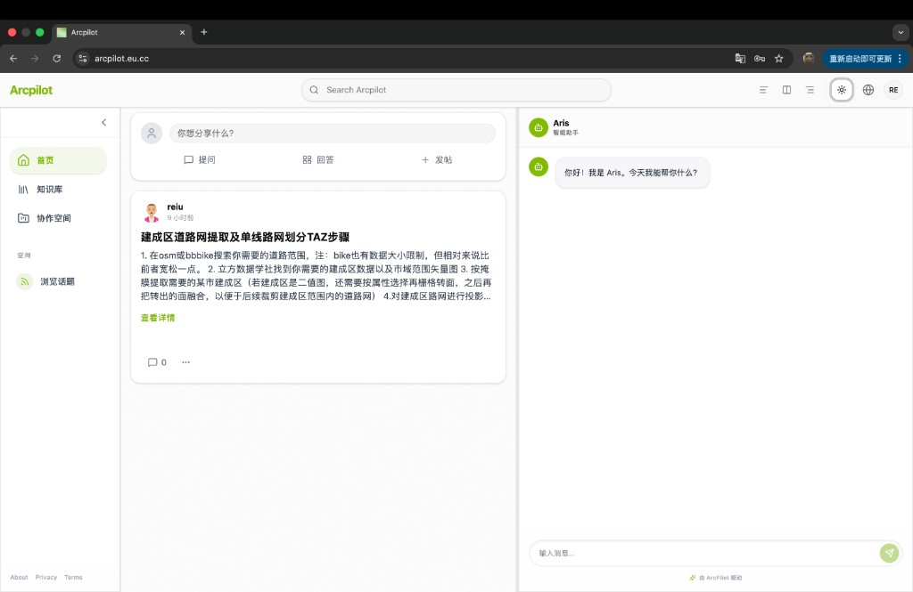

# ArcPilot

ArcPilot is a community + AI helper project for geospatial and domain-specific workflows.

Project status: **active development**.



---

## What This Project Is For

This project focuses on three practical issues:

- GIS/CAD troubleshooting info is spread across too many sources
- Standards/spec documents are hard to search and quote quickly
- General discussion platforms usually don’t carry spatial context well

ArcPilot is meant to be one place for discussion, references, and AI-assisted workflows.

---

## Current Scope

### Implemented

- Community basics: posts, replies, tags, user system
- Split architecture: `frontend/` + `backend/`
- Runnable backend API and data model foundation (FastAPI + SQLModel)
- Core frontend pages and interactions
- Light/Dark theme switch

### In Progress / Not Finished

- Deeper RAG integration
- End-to-end citation completeness
- Full E2E stability (Playwright)

---

## Tech Stack

- Frontend: React + TypeScript + Vite + Tailwind CSS
- Backend: FastAPI + Python
- Data layer: PostgreSQL / PostGIS + SQLModel
- Tooling: `bun` (frontend), `uv` (backend)

---

## Project Structure

```text
ArcPilot/
├── backend/
├── frontend/
├── docs/
├── deploy/
├── scripts/
├── compose.yml
```

---

## Local Development

### 1) Backend

```bash
cd backend
uv sync
uv run fastapi run app/main.py --reload --port 8000
```

### 2) Frontend

```bash
cd frontend
bun install
bun run dev
```

---

## Testing and Checks

### Backend

```bash
cd backend
uv run pytest
```

### Frontend

```bash
cd frontend
bun run lint
bun run build
```


