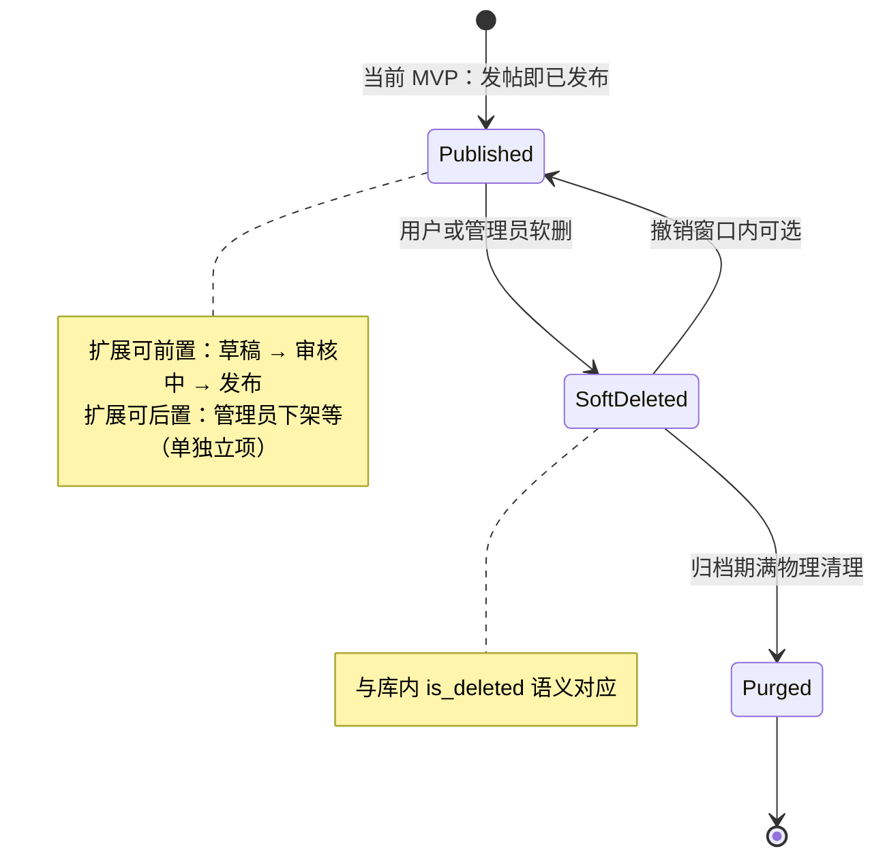

# 帖子删除与顶栏搜索：给初学者的说明

## 这份文档是写给谁的

写给**还不熟悉本项目代码**的同学：例如产品经理、新加入的前后端开发、或者想确认「功能到底有没有做」的任何人。文中会先用人话说明**用户界面上会怎样**、**现在缺什么**，再说明**若要做**时的风险与分级方案。

**怎么读（避免「小白段落」和「硬核段落」混在一起晕掉）**

| 你是谁 | 建议读哪里 |
|--------|------------|
| **产品 / 运营** | 两个用户问题、一页纸总结、**「帖子生命周期（状态图）」**、**「搜索分级（阶段定义）」**、**「空状态：别只做暂无数据」**、数据归档策略里与「保留多久」相关的句子 |
| **后端 / 架构** | 全文；重点看 **「方案补充」** 与 **「深度补充」** 各节 |
| **排期 / 评审** | **「技术决策树（何时用 A，何时必须切 B）」** —— 用来对齐预期，避免 PM 以为「已经写了优化」而实际只做了 MVP |

文末有 **「术语表（给非开发）」**，遇到 IDOR、JWT 等可跳过去看一句话解释。

---

## 先搞清两个「用户问题」分别是什么

### 问题甲：用户能不能删掉**自己发**的帖子？

- **用户期望**：我发错帖了、或者不想留了，点一下「删除」，这条帖子对别人也看不见了（或按产品规则处理）。
- **我们要回答的**：现在 App 里有没有这个能力？如果没有，缺的是哪一环？

### 问题乙：页面最上面那条「搜索框」是真的在搜吗？

- **用户期望**：输入关键词、按回车或点搜索，能看到和关键词相关的帖子（或文章、用户等）。
- **我们要回答的**：现在会不会搜数据库？会不会跳到结果页？如果不会，算不算「假搜索」？

下面分别说明。

---

## 问题甲：删除自己的帖子

### 用人话说：现在怎么样了？

**结论（当前版本）：作者可以删除自己发的帖子（软删）。**

更细一点：

1. **界面上**：帖子详情页有「删除帖子」按钮；Feed 卡片「⋯」菜单中作者可见删除项；均需二次确认。
2. **服务器（后端）**：`DELETE /api/v1/posts/{post_id}`，仅当 `author_id` 与 Token 解析出的当前用户一致时成功；否则 403；已删或不存在 404。带简单删帖频率限制（单进程内存）。
3. **数据库**：将 `is_deleted` 置为真；列表与详情查询本就过滤未删除帖，回复随主帖对读者不可见（读详情时 404）。

**历史背景（实现前）**：曾长期只有 `is_deleted` 字段、无接口与前端入口，整条链路未接上。

### 几个词是什么意思（看懂下面「怎么做」够用）

| 词 | 简单解释 |
|----|----------|
| **后端 / 服务器** | 运行在服务器上的程序，负责存数据、校验「是不是本人」等。 |
| **接口（API）** | 前端或别的客户端「告诉服务器要做什么事」的一种方式，例如「创建帖子」「拉取列表」。 |
| **软删除** | 不在数据库里物理删掉那一行，只把「已删除」设为是；列表查询时过滤掉。好处是数据还可恢复、关联不乱。 |
| **鉴权** | 服务器检查「当前登录的是谁」，确保只有**帖子作者本人**（或管理员）能删，别人不能删你的帖。 |

### 如果以后要做删帖，大致要做什么？（分步，小白友好）

**第一步：服务器增加「删帖」能力**

- 增加一个只给已登录用户用的删帖接口（常见形式是：`DELETE`，路径里带帖子 ID）。
- 收到请求后：根据帖子 ID 找到那条帖子 → 用**服务端可信的当前用户**（见下文「方案补充」）核对「是不是作者」→ 若是，把该帖的「已删除」标记设为真 → 保存。
- 若**不是作者**，应拒绝（例如返回「禁止操作」）。
- 已删过的帖再删一次，可以返回「找不到了」之类，避免歧义。

**第二步：前端加上按钮和流程**

- 只在「当前浏览的用户就是帖子作者」时显示「删除」。
- 点击后最好有二次确认（防止误触）。
- 删成功后：刷新列表或跳回论坛首页，让用户看到帖子已经没了。可选：软删除后短时间「撤销」（见「方案补充」）。

**第三步：测试与产品规则**

- 测一测：本人能删、别人不能删、没登录不能删。
- 和产品对齐：删帖后，下面别人的回复是跟着一起隐藏，还是另有规则（技术上可以分阶段做）。

---

## 问题乙：顶栏搜索框

### 用人话说：现在怎么样了？

**结论（当前版本）：顶栏搜索会跳转到 `/search?q=…` 并请求后端，按文档 **S1** 只匹配帖子标题子串。**

具体表现：

1. 输入关键词并回车 → 进入搜索结果页，展示 `GET /api/v1/posts/search` 返回的列表。
2. **不搜正文**、**不分词**；与知识库内搜索仍是不同接口。

**历史背景（实现前）**：顶栏仅为占位，无跳转、无请求。

### 不要和「知识库里的搜索」搞混

在本项目里，**协作空间内的知识库文档**已经有一种真正的搜索：在某个空间内，按关键词搜文档标题和摘要。那是**另一个页面、另一套接口**，**不能**用来回答「顶栏搜全站帖子」有没有实现。

顶栏要的是：**在论坛场景下，按关键词找帖子**——这一块目前**没有**接上。

### 几个词是什么意思

| 词 | 简单解释 |
|----|----------|
| **占位** | 界面先画出来，核心逻辑以后再做。 |
| **关键词搜索** | 用户输入一段话里的若干字，系统在标题、正文里找包含这些字的内容。 |
| **分页** | 结果很多时，一页只显示一部分，可以翻页或加载更多。 |

### 如果以后要做「真搜索」，大致要做什么？

**第一步：服务器能「按关键词查帖子」**

- 提供一个接口：前端把用户输入的关键词传过去，服务器在数据库里查**未删除**的帖子，在**标题和正文**里匹配关键词（实现上可以从简单的「包含匹配」开始；规模大了要升级，见「方案补充」）。
- 结果太多时要支持分页，和首页 Feed 的翻页方式尽量一致，避免两套规则让人晕。

**第二步：前端顶栏和搜索页连起来**

- 用户在顶栏输入关键词并搜索时：**跳转到专门的搜索结果页**（地址里带上关键词，例如 `?q=xxx`），这样链接可以分享、刷新不丢。
- 搜索结果页根据关键词去调上面的接口，把返回的帖子列表展示出来；**无结果时要有空状态设计**（见「方案补充」）。

**第三步：以后再优化（可选）**

- 帖子特别多时，可以换成更专业的搜索方案（例如全文检索引擎），让速度更快、排序更聪明。简单匹配能先让「顶栏搜索」从假变真，但**不能假装没有性能与体验上限**。

---

## 一页纸总结（给忙的人）

| 用户关心的事 | 实现状态 | 说明 |
|--------------|----------|------|
| 删除自己发的帖子 | **已做 MVP** | 后端 `DELETE /api/v1/posts/{post_id}` 软删，仅作者；每分钟每用户删帖次数有限流。前端：帖子详情页按钮 + Feed 卡片菜单「删除」，确认对话框。 |
| 顶栏搜索帖子 | **已做 S1** | 后端 `GET /api/v1/posts/search?q=`：**仅标题** ILIKE 子串，未删帖；分页参数 `skip`/`limit`。前端：顶栏回车跳转 `/search?q=`，结果页展示列表 + 无结果时引导话题/发帖。 |

**尚未覆盖（见上文深度补充）**：归档物理清理、搜索缓存、全文/分词（S2）、管理员删帖与审计字段、多 worker 下删帖限流一致性等。

---

## 文档依据与如何核对（避免路径过时）

代码会搬家，**以运行中的 API 文档为准最稳**：后端启动后打开项目自带的 OpenAPI（常见为 `/docs`），看「posts」相关路径是否已出现删除、搜索等操作。

若要在仓库里搜代码，可按**逻辑**理解，不必死记文件名：

| 逻辑 | 在仓库里大致是什么 |
|------|-------------------|
| 帖子 HTTP 接口 | 后端里注册为 `posts` 前缀的路由模块 |
| 帖子表结构 | 内容域模型里名为 `Post` 的表定义（含 `is_deleted`） |
| 顶栏搜索框行为 | 前端顶栏引用的「搜索」hook：提交时是否跳转、是否发请求 |
| 知识库内搜索 | 挂在「空间 + 知识库」下的 search 接口，与论坛顶栏不是同一路 |

---

## 方案补充：软删除、搜索、安全、体验、文档维护

（回应初版说明里有意简化后容易遗漏的闭环与风险，便于评审和排期。）

### 1. 软删除：光有一个 `is_deleted` 不够，要闭环

**评论、点赞、收藏等「连坐」**：需要产品先定规则，再在列表、详情、统计里统一实现，否则会出现「界面以为删了、数字还对不上」。

- **常见做法**：主帖软删后，**Feed / 搜索 / 他人视角**都不再露出；详情可 404 或「已删除」占位；**回复**不再单独成流，或统一显示「原帖已删除」，避免孤儿评论。
- **点赞、收藏**：若表里有指向帖子的记录，对外查询时一律要求关联帖子且 **`is_deleted = false`**，「我的收藏」里才会与「帖已删」一致。
- **计数接口**（如用户发帖数）：SQL 必须带 **`is_deleted = false`**，与列表规则一致。

**唯一索引**：当前仓库里帖子**标题没有唯一约束**，短期内「同标题冲突」风险低。若以后加「每用户标题唯一」等约束，应对**未删除**行建**部分唯一索引**（`WHERE is_deleted = false`），否则软删行会占住唯一槽，用户无法新发「同名」帖。

**审计**：用户删帖与管理员删帖若需区分、追溯，可扩展 `deleted_at`、`deleted_by_user_id` 等；MVP 可只做作者软删，但应预留扩展。

### 2. 搜索：简单 `LIKE` 可作第一步，但要认识代价与边界

**性能**：两侧 `%` 的模糊匹配在数据量大时易全表扫描，并发高会吃满 CPU。可配合：限制关键词长度、结果条数、超时与慢查询监控；量上万起考虑 **全文检索 / trigram 索引 / 独立搜索引擎**。简单实现可先行，**排期里应写清规模上限与升级路径**。

**错拼与同义词**：简单匹配下错一个字就可能零结果，需在空状态或文案里管理预期；明显好于「Ctrl+F」需要分词、模糊或搜索服务，适合作为第二阶段。

### 3. 接口安全：鉴权不是「对一下 id」

**IDOR**：当前用户身份只能来自**服务端可信上下文**（JWT 解析、`CurrentUser` 依赖等），**绝不能**用请求里客户端传来的 `user_id` 当「我是谁」。

**业务状态**：若有封禁、申诉中等状态，删除权限要产品定义并在接口里**显式判断**（例如仅管理员可删封禁帖）。

### 4. UI/UX

- **搜索无结果**：单独设计空状态（换词建议、热门推荐等），避免用户以为坏了。
- **软删除与撤销**：短时间窗口内「撤回删除」（Snackbar + 后端撤销或改回标记）可显著减少误触客诉；是否与产品规则一致需一并定。

### 5. 本文档的维护方式

优先链到 **OpenAPI** 与**按路由前缀/模型类名搜索**；上文已用逻辑位置代替硬编码路径。若仓库中有「开发者入口」页链接到 `/docs`，新人更不容易跟丢。

---

## 技术决策树：何时方案 A，何时必须切到方案 B

（给排期用：避免「文档里提了优化」被理解成「第一版就做满」。）

**删帖 / 数据**

- **数据量小、要快速上线**：软删除 + 所有列表/统计统一带「未删除」条件即可。
- **软删行数长期占比高（例如占总帖子 20% 以上）、磁盘与备份明显膨胀**：必须上 **归档/物理清理策略**（见下节「僵尸数据」），不能只靠 `is_deleted` 无限堆。
- **回复列表独立高并发读**：仅靠「查回复时 Join 主帖是否删除」可能吃紧 → 考虑 **回复侧冗余可见性字段**（主帖删除时批量更新，或异步任务 + 可重试），与「实时 Join」二选一要有意识，不能口头说「跟着隐藏」却不选实现。

**搜索**

- **第一阶段（明确写进范围）**：建议 **仅标题** 或 **标题 + 短摘要字段**（若有），避免一上来全文 `LIKE %q%` 把正文拖进全表扫描；并写清 **「不支持分词、语序颠倒」**。
- **第二阶段**：PostgreSQL 场景优先考虑 **pg_trgm**（模糊、部分错拼）或 **全文检索 + 中文配置**；Urban Planning 等专业词多时，**「不支持分词」不能假装够用**，要么阶段二做分词/全文，要么产品上明确降级为「精确短语搜索」。
- **第三阶段**：独立搜索引擎 + 索引流水线；过渡期的缓存与一致性见下节。

**安全**

- **任何阶段**：当前用户身份只来自 Token / Session，**不限流也要至少防脚本狂删** → 删除接口应 **按用户/IP 限流**（见下节）。

---

## 深度补充一：软删除的「僵尸化」、归档与「连坐」性能

### 僵尸数据与表膨胀

软删行仍会占表空间、备份体积和**部分索引体积**。若运营一年后大量帖子被删，**所有**面向用户的列表、统计若都扫大表再过滤 `is_deleted`，长期成本会上升（不是说不能做，而是**要有生命周期计划**）。

**建议单独做「数据归档 / 物理清理」产品+技术决策**（示例，具体天数由法务与运营定）：

- 软删超过 **N 天** 且无需审计争议时：**物理删除**帖子行（或迁入冷归档库），回复可按外键策略一并清理或匿名化。
- 备份与监控：关注表大小、慢查询；**部分索引**（`WHERE is_deleted = false`）可减轻活跃查询的索引垃圾感，但**不能替代**「旧软删数据最终搬走」。

### 「回复跟着隐藏」：Join 还是批量改回复？

两种都是正经实现，代价不同：

| 路线 | 做法 | 优点 | 风险 |
|------|------|------|------|
| **A. 读时 Join** | 拉回复列表时关联主帖，过滤已删主帖 | 删帖只改一行，逻辑集中 | 高并发、深分页时 Join 成本上升 |
| **B. 写时扩散** | 主帖软删时把下属回复标为不可见（或异步任务批量更新） | 读回复路径简单 | 批量更新耗时长；**宕机中途**可能部分未更新 |

**一致性（针对路线 B）**：异步任务应 **可重试、幂等**（例如按 `post_id` 反复执行「把未删回复标隐藏」直到无剩余）；或用 **事务 + 限制单次批量行数** 分段提交。不要假设「一次请求必跑完」。

---

## 深度补充二：搜索分级、缓存一致性、中文与专业词

### 搜索分级（请写进需求文档，不要只说「以后优化」）

| 阶段 | 能力边界（对外可承诺） | 典型实现 |
|------|------------------------|----------|
| **S1** | 仅 **标题** 子串匹配（或标题+短摘要）；明确 **不保证** 语序、分词、同义词 | 受控的 `LIKE` / 前缀匹配 + 严格限流与超时 |
| **S2** | 支持 **模糊/错拼** 或 **全文检索**（含中文配置）；仍可有性能上限说明 | `pg_trgm`、PostgreSQL FTS、或轻量分词管道 |
| **S3** | 相关度排序、高亮、大规模与多字段统一 | Meilisearch / Elasticsearch 等 + 同步与运维 |

### 缓存与「删了还能搜到」

若搜索结果走了缓存（Redis、CDN、边缘），会出现：**帖已删，缓存里仍有旧列表**。

缓解思路（可组合）：

- **写穿透**：删帖（或改可见性）时 **主动失效**与该帖相关的搜索缓存键；或提高缓存版本号使旧键整体作废。
- **短 TTL + 可接受最终一致**：产品上承认「数秒内可能不一致」，文案一般不展开，但**开发评审要明说**。
- **以数据库为权威**：第一版甚至可以 **不做搜索缓存**，先 correctness，再优化。

### 「模糊匹配」与中文（Urban Planning 场景）

`LIKE %城市规划%` **找不到**「规划城市」是预期行为，不是实现 bug；若社区定位是知识型、专业词多，**S1 阶段就要在文案或空状态里写清**：当前是「短语/子串」能力，避免用户以为是 Google。

要在体验上接近「像搜知识库」：**S2 起**引入 **全文检索 + 中文分词配置**，或 **应用层分词（如 jieba 等）+ 倒排**；选型与运维成本在决策树里已指向「必须切 B」的时机。

---

## 深度补充三：限流、状态机与「删帖逃罚」

### 批量删除与速率限制

即使用户是「本人」，也不应允许 **短时间数百次删除**把精华内容瞬间清空（盗号、脚本、误运行脚本）。

- 对 **删除接口** 做 **按用户**（及可选按 IP）的 **Rate limit**（例如滑动窗口内次数上限）。
- 可与 **二次确认、重要操作二次验证**（邮件/2FA）等产品策略组合。

### 状态机：审核中或平台处置流程中时还能删吗？

若只校验 `user_id == author`，可能出现：**平台已对内容采取处罚、下架或审核流程时，用户通过删帖逃避展示或后续处置**。

需要 **帖子生命周期状态**（见下图；其中「审核中」等可为规划中能力）并在删除接口中写清：

- 例如：**审核中 / 平台介入处置中** 时 **禁止用户删除**，仅管理员可按规则处理；或允许删但 **保留审核副本**（合规向，实现更重）。

**与当前产品一致**：前端帖子卡片**不提供**「举报」「不感兴趣」入口；本地「隐藏帖子」列表也已移除。下文状态图**不包含**「被举报」分支；若未来重新上线举报/审核，再单独补状态与接口。

当前代码里的 `Post` 模型**未必已有**这些状态字段；上图包含 **现状 + 扩展**，落地时以实际表结构为准。

---

## 深度补充四：空状态——知识型社区别停在「暂无数据」

搜索无结果时，空状态是 **引导转化** 的机会，建议在需求里写清优先级（可迭代）：

1. **解释 + 降预期**：说明当前搜索能力（例如仅标题、不支持分词），给 **换词建议** 或 **拆词搜索** 提示。
2. **相关话题 / 标签**：推荐与查询词或用户历史相关的话题，引导进入 **话题 Feed**。
3. **引导创作**：「没搜到？发第一个相关讨论」跳转发帖（与 ArcPilot 社区目标一致时优先）。
4. **热门或编辑精选**：冷启动或词太偏时兜底。

避免开发默认只做一个无插图的「暂无数据」。

---

## 帖子生命周期（状态图）

下图帮助产品、新人 **对齐「帖子的几种状态」**。**产品说明**：当前不提供用户侧举报与「不感兴趣」；状态图不画「被举报」流转，避免与界面能力不一致。

若 Mermaid 在你们的阅读器里不渲染，可只看文字版：**发布 →（可选：草稿/审核）→ 软删 →（可选）物理清理**。

---

## 术语表（给非开发，一句话）

| 词 | 一句话 |
|----|--------|
| **IDOR** | 用改参数的办法操作别人的数据；后端必须只信登录态，不能信前端传的「我是哪个用户」。 |
| **JWT** | 一种登录后发给浏览器的「加密通行证」，服务器靠它认出你是谁。 |
| **OpenAPI** | 机器可读的接口清单，常对应网页上的 `/docs`，用来查现在到底有哪些 API。 |
| **Rate limit** | 限制同一用户在短时间内的请求次数，防脚本刷接口。 |
| **pg_trgm** | PostgreSQL 的扩展，用来做「有点像」的模糊匹配，减轻纯 `LIKE` 的一些痛点。 |
| **全文检索 / 分词** | 把句子拆成词再建索引，解决「语序不同搜不到」等问题，比子串匹配贵、但更像「真搜索」。 |
