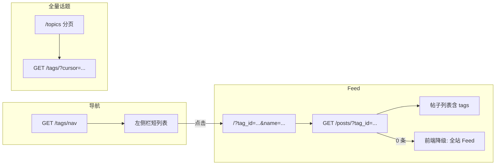

# 话题侧栏与 Feed 筛选：问题说明与解决方案（修订版）

本文档在「业务问题 + 技术闭环」基础上，合并了**规则驱动侧栏**、**数据库聚合优化**、**稳定 URL 策略**、**空状态降级**、**话题溢出与去重**等补充方案，供决策与研发统一参照。与 [社区闭环 MVP 流程图](./社区闭环_MVP_流程图.md) 的衔接见第 8 节。

---

## 1. 写给决策者的话（不懂技术也能看懂）

**我们想做的事：** 用户在左边点一个话题（例如「遥感影像」），中间应只看到与该话题相关的帖子；左边显示哪些入口，应**可运营、可演进**，且与发帖时选用的话题**同源**（同一套数据），避免「看起来像分类、实际不生效」。

**原先方案的核心矛盾：** 若依赖「人工在后台勾选官方话题（`is_official`）」，在**人力不足**时难以持续维护，侧栏容易空窗或继续依赖写死假数据。

**修订后的方向（可二选一或组合）：**

- **热门驱动：** 侧栏展示「近期活跃 / 发帖多的话题」，少人工、侧栏内容随社区自然变化。
- **代码常量：** 若产品只要固定几个核心入口（如 GIS、遥感），可在后端用**固定话题 ID 列表**配置，发布即生效，不必先做管理后台。

**仍必须补齐的能力：** 按话题筛选帖子列表、列表/详情带出话题信息、话题很多时的分层与分页、链接尽量不因改名而失效。

---

## 2. 背景（产品视角）

- 用户发帖时可勾选**话题**（分类标签），数据**已能持久化**并与帖子关联。
- 第一版为提速，信息流/详情对话题展示较弱；列表接口曾**不返回**话题字段或返回空数组。
- 左侧「GIS / 遥感 / 数据工程」等曾为**前端假数据**，与库内真实话题列表**未打通**。

---

## 3. 当前问题（叙述对象：非技术读者）

### 3.1 「左边的话题」和「真话题」曾可能是两套东西

**用户眼里：** 左边话题名与社区里的话题是一回事。  
**实际上（历史现状）：** 若为写死文案，则与真实列表不同步；新建话题不会自动出现在左边。  
**影响：** 左侧难以作为运营阵地，易产生误解与沟通成本。

### 3.2 点左边话题若仍指向纯首页，等于「再点一次首页」

**预期：** 点「遥感」只看遥感相关帖。  
**若未改：** 无筛选条件，体验**误导**。  
**影响：** 损害信任。

### 3.3 系统需具备「按话题筛帖子」的对外能力

**预期：** 选话题 → 见该话题下的帖子列表。  
**缺口：** 列表接口若仅支持翻页、不支持按话题过滤，则「话题页 / 专区」无法诚实实现。  
**影响：** 产品承诺与实现不一致。

### 3.4 帖子上应能体现「属于哪些话题」

**预期：** 刷流或进详情能看到话题。  
**缺口：** 接口长期返回空 `tags` 则前端难展示。  
**影响：** 社区感与后续推荐、统计偏弱。

### 3.5 「所有话题都上左边」不可行

话题量上来后：侧栏过长、质量参差、拉全表成本高。  
**结论：** **分层**——侧栏短列表 + 「查看全部话题」进独立页（如 `/topics`）。

### 3.6 仅依赖「人工标官方」易断档

无人维护时，「只显示官方」的侧栏会空，或退回假数据。  
**修订思路：** 用**热门排序**或**代码内固定 ID 列表**降低对人工后台的依赖（见第 4、5 节）。

### 3.7 话题「溢出」：界面与性能

从十个到上千个话题时，侧栏与全量列表页都需要约束：**侧栏**只放「常驻能力（如我的关注/收藏，若产品有）」+「热门或固定入口」+**「更多」**；**全量页**必须**分页**（建议游标分页），避免一次把数千标签推给浏览器。

### 3.8 标签重复与碎片化（如 GIS / gis / 地理信息系统）

若不去重与引导，同一主题多标签会**切碎 Feed**。  
**方向：** 存储层 `slug` **规范化**（小写、去特殊字符）、**唯一约束**；发帖选标签用**搜索联想**，优先选用已有标签。

---

## 4. 解决方案总览（研发）

### 4.1 `GET /api/v1/posts/`：按话题筛选（必做）

在 `skip`、`limit` 上增加可选参数（与下文 URL 策略一致时，**以后端只认稳定标识为准**）：

| 参数 | 说明 |
|------|------|
| `tag_id` | 话题对外 ID（`Tag.public_id`，UUID，**推荐作为唯一筛选依据**） |
| `tag_slug` | 话题 slug（可选支持；若存在改名风险，产品层更推荐以 `tag_id` 为主） |

**行为：**

- 不传：全站时间序 Feed（与现有一致）。
- 传 `tag_id`（和/或 slug，团队定是否双参）：只返回经 `post_tags` 关联且未删除的帖子，`created_at` 降序分页。
- 话题不存在：统一 **404** 或 **422**（团队选一种）。

**实现：** `Post` 与 `PostTagLink`、`Tag` **内连接**过滤；**无需新表**。

### 4.2 列表与详情返回真实 `tags`（必做）

- **列表：** 每条帖子带 `tags[]`。  
- **详情：** 带该帖全部关联话题。

**性能（修订建议 — PostgreSQL）：** 避免在应用层对每条帖子循环查库（典型 N+1）。可在**一条 SQL** 中用子查询或 LATERAL + `json_agg`（或等价 ORM 能力）把每帖的标签聚成 JSON 数组，再在服务端映射为 `TagPublic[]`，逻辑以**透传/轻量解析**为主，减少手写 merge 出错面。  
（具体 SQL 需与当前表名、字段及 ORM 写法对齐后落地。）

### 4.3 侧栏数据源：`GET /tags/nav` 或与全量列表分离（必做）

**原则：** 侧栏**不要**直接等于无过滤的全量 `GET /tags/`。

**实现选型（可并存，按阶段选一种主策略）：**

| 策略 | 做法 | 优点 | 代价 / 注意 |
|------|------|------|-------------|
| **A. 热门话题** | `GET /tags/nav` 内按**发帖关联数**或预计算 `post_count` 排序，`LIMIT N` | 少运维、随社区变化 | 需约定统计口径（全量历史 vs 近 7 天）；可能要定时任务或物化列 |
| **B. 代码常量** | 后端常量 `NAV_TAG_PUBLIC_IDS = [uuid, ...]`，只返回这些 | 无后台也可固定核心入口，改发布即可 | 换环境要同步常量；不灵活 |
| **C. 官方标记** | `official_only` + 种子数据或管理员 `PATCH` | 强运营控制 | 依赖人或后台，易断档 |

**推荐组合（个人/小团队减负）：** 默认 **A 热门 Top N**；核心栏目强绑定时用 **B** 兜底；有运营人力后再上 **C**。

全量浏览仍由 **`GET /tags/` + `/topics` 页**承担；该列表接口需支持**分页**（见 4.6）。

### 4.4 稳定 URL：双段策略（修订）

**问题：** 仅依赖 `slug` 时，运营改名可能导致旧链接失效或语义变化。

**做法（参考常见社区产品）：**

- URL 或 query **必须带稳定标识**：`tag_id`（`public_id`）。  
- 可同时带 **可读名**（如 `name` 或 slug）仅供展示与 SEO，**后端筛选只认 `tag_id`**，忽略可读段变化。

**示例：** `/?tag_id=<uuid>&name=gis` —— 改名后旧链仍指向同一话题实体。

### 4.5 空状态：前端降级（体验必做）

当带 `tag_id` 筛选**结果为空**时：

- 文案示例：「该话题下暂时没有帖子，为你展示全站热门/最新内容」。  
- 行为：自动再请求**不带话题筛选**的 Feed（或全站推荐接口），避免白屏与冷场。

（具体文案与是否二次请求由前端与产品定；后端可提供同一列表接口不传参即全站。）

### 4.6 话题溢出与性能

- **侧栏：** 仅展示 Top N 或常量列表 + **「查看全部话题」**链到 `/topics`。  
- **`GET /tags/` 全量：** 必须 **分页**（推荐 **cursor / seek** 分页），禁止默认一次返回全表。

### 4.7 标签去重与引导

- **存储：** `slug` 规范化（小写、去特殊字符等，与现有一致性策略对齐）；库表 **UNIQUE(slug)**。  
- **创建：** 已有同名/近名校验（当前后端已有部分逻辑，可继续强化）。  
- **发帖选标签：** 搜索式下拉 + 联想已有标签，减少「GIS」「gis」重复建标。

### 4.8 可选表结构（第二阶段）

若热门口径需落库：

- `tags.post_count`（可定时刷新）或独立统计表。  
- `tags.nav_order`、`tags.show_in_nav`：与「官方 / 是否上侧栏」解耦。

首版可用查询时 `COUNT` 子查询或缓存，视量级再物化。

### 4.9 前端配合

- OpenAPI 变更后**重生成 client**（`listPosts` 增加 `tagId` 等）。  
- 侧栏调 `GET /tags/nav`（或等价）；链接带 **`tag_id` + 可选可读名**。  
- 首页/Feed 根据 query 调用带筛选的列表；实现 **4.5 空状态降级**。  
- 移除或仅本地保留 `DEMO_TOPICS` 占位。

---

## 5. 个人开发「减负」实施顺序（建议）

为在人力有限时仍能闭环，建议优先级：

| 顺序 | 任务 | 目的 |
|------|------|------|
| 1 | 侧栏改为 **热门 Top N** 或 **代码内固定 `tag_id` 列表**，不依赖人工勾选官方 | 去人工化、侧栏先有真实数据 |
| 2 | `list_posts` 增加 **`tag_id`** 过滤 | 核心筛选能力 |
| 3 | 列表/详情返回 tags；列表侧优先 **SQL 聚合** 减少 N+1 | 性能与代码简洁 |
| 4 | 前端 **空状态全站补位** | 体验不断档 |
| 5 | `/tags` 全量 **分页** + 发帖 **标签联想** | 抗话题膨胀、减重复标签 |

有运营与后台后再补：`is_official`、管理端 `PATCH`、更细的热门算法等。

---

## 6. 目标闭环（业务语言 + 示意图）

**业务语言：** 用户打开产品 → 左侧看到「热门或固定核心」的少量话题（来自真实数据）→ 点击后 URL 带稳定 `tag_id` → 中间列表只显示该话题下的帖子（无帖时降级全站）→ 帖子上可见话题标签；需要浏览全部话题则进入 `/topics`（分页）。



---

## 7. 最小落地清单（自检）

| 项 | 说明 |
|----|------|
| `list_posts` 支持 `tag_id`（必选）；`tag_slug` 可选 | 按话题筛 Feed |
| 列表/详情返回真实 `tags`；列表优先 DB 聚合降 N+1 | 展示与性能 |
| `GET /tags/nav` 或等价（热门 Top N 或固定 ID） | 侧栏与全量分离 |
| URL **以 `tag_id` 为主**，可读参数可选 | 链接稳定 |
| 前端空状态降级 | 无帖不断档 |
| `GET /tags` 分页 + slug 唯一与选标签联想 | 抗规模、减碎片 |

---

## 8. 与 MVP 文档的关系

[社区闭环 MVP 流程图](./社区闭环_MVP_流程图.md) 曾约定 MVP 阶段 **tag 在 UI 上不强调**。本文档为**下一阶段**闭环；落地后建议在 MVP 文档增加修订说明或指向本文档，避免接口仍返回空 `tags` 与界面预期冲突。

---

## 9. 术语速查（可选）

| 术语 | 人话 |
|------|------|
| `tag_id` / `public_id` | 话题在系统里的**永久编号**，改名不变 |
| `slug` | 话题的**短链名**，可能随运营调整，宜作展示而非唯一依赖 |
| `GET /tags/nav` | **给左边栏用**的短列表接口，不是全站所有话题 |
| 热门 / 固定 ID | 侧栏内容**谁说了算**：数据自动算出来，或程序员在配置里写死几个 |


## 10. 技术实现方案（研发落地）

本节在上文产品与技术约定之上，按**模块**写出可执行的实现要点；路径以当前仓库 `arcpilot/backend`、`arcpilot/frontend` 为准，实施时可随重构微调文件名。

### 10.1 范围与前置条件

- **数据库：** PostgreSQL（已用）；`posts`、`tags`、`post_tags`（`PostTagLink`）表已存在。
- **认证：** 现有帖子列表、标签列表均为登录后可调；新接口保持同一套 `CurrentUser` / `SessionDep` 策略即可。
- **交付物：** 后端路由与查询、OpenAPI 变更、前端接入与文案；可选迁移脚本或 `initial_data` 种子。

---

### 10.2 后端：`GET /api/v1/posts/` 扩展

**文件主入口：** `app/api/routes/posts.py`（`list_posts`）。

**查询参数（FastAPI）：**

- `tag_id: uuid.UUID | None = None`
- `tag_slug: str | None = None`（可选；若与 `tag_id` 同时传，约定 **以 `tag_id` 为准** 或两者必须指向同一标签否则 422，团队二选一写进文档）

**解析标签：**

- 若传 `tag_id`：`select Tag where Tag.public_id == tag_id`，无则 **404**（推荐，语义为「资源不存在」）。
- 若仅传 `tag_slug`：按 `Tag.slug` 查；无则 404。

**帖子主查询：**

- 基础：`Post.is_deleted == False`，`order_by Post.created_at.desc()`，`offset(skip)`，`limit(limit)`。
- 带标签过滤时：`join PostTagLink on PostTagLink.post_id == Post.id`，`where PostTagLink.tag_id == tag.id`（使用内部 `tag.id`）。若 ORM 懒加载不便，可用 `where Post.id.in_(select(PostTagLink.post_id).where(PostTagLink.tag_id == tag.id))` 等价子查询。

**返回体：**

- 每条 `PostPublic` 填充真实 `tags: list[TagPublic]`（见 10.4）。

---

### 10.3 后端：`GET /api/v1/posts/{post_id}` 详情

**同一文件** `get_post_detail`：在取到 `post` 后加载其关联 `Tag` 列表（`session.exec` 关联查询或 `selectinload`），映射为 `TagPublic`，**不再**固定返回 `tags=[]`。

---

### 10.4 列表接口批量附带 `tags`（避免 N+1）

**目标：** 本页 `post` 主键集合为 `P = {p.id ...}`，一次性得到 `post_id -> [Tag]`。

**实现路径（择一）：**

1. **SQLAlchemy 2 / SQLModel：** 对列表查询使用 `options(selectinload(Post.tags))`，让 ORM 发 2～3 条 SQL（主查询 + IN 批量加载 tags），再循环 `_tag_to_public`。实现快，数据量中等时足够。
2. **原生 SQL + `json_agg`（PostgreSQL）：** 主查询子查询或 `LATERAL` 为每行附加标签 JSON；在 Python 中 `json.loads` 并转为 `TagPublic`。单请求延迟更可控，适合 Feed 高 QPS。

表名与模型对齐：`posts`、`tags`、`post_tags`（列 `post_id`、`tag_id` 对应 `PostTagLink`）。

**映射字段：** 与现有 `TagPublic` 一致（`id` 用 `public_id`、`name`、`slug`、`is_official` 等）；`owner_public_id` 若列表不需可省略查询以减负。

---

### 10.5 新接口：`GET /api/v1/tags/nav`

**挂载：** 与现有 `tags_router` 同级，在 `app/api/main.py` 已 `include_router(posts.tags_router)`，新路由加在同一 `APIRouter(prefix="/tags")` 上，路径为 **`GET /tags/nav`**。

**响应模型：** 复用 `TagsPublic`（`data` + `count`）或更窄的 `TagNavPublic`（若侧栏只需 `id/name/slug/post_count`）。

**策略 A — 热门 Top N：**

- SQL 思路：`tags` 左连 `post_tags` 聚合 `COUNT(*)`，按计数降序，`LIMIT N`（如 10）。  
- 性能：数据大时在第二阶段加 `tags.post_count` 列 + 定时任务刷新，避免每次全表聚合。

**策略 B — 固定列表：**

- 在 `app/core/config.py` 或专用模块定义 `NAV_TAG_PUBLIC_IDS: list[UUID]`（可从环境变量解析逗号分隔 UUID）。  
- 查询：`Tag.public_id.in_(ids)`，再按配置顺序 `sort`（Python）保证侧栏顺序稳定。

**组合：** 若配置了 `NAV_TAG_PUBLIC_IDS` 非空则走 B，否则走 A（在代码里写清优先级，避免行为不明）。

---

### 10.6 全量标签：`GET /api/v1/tags/` 分页

**现状：** 一次性 `select(Tag).order_by(Tag.slug)`，话题上千时有风险。

**建议契约：**

- 保留无参行为为「第一页」或标记 deprecated，逐步切到分页。  
- **游标分页：** 查询参数 `cursor`（可为 `slug` 或 `(created_at, public_id)` 编码的 opaque string）、`limit`（默认 50，上限 100）。  
- 响应增加 `next_cursor` / `has_more`（可新设 `TagsPublicPaged` 模型）。

**实现：** `where Tag.slug > :cursor_slug order by Tag.slug limit :limit+1` 判断是否还有下一页；cursor 使用 urlsafe base64 打包多字段时需防篡改可选。

---

### 10.7 配置、种子与运维

- **`initial_data.py`：** 创建首批 `Tag`（若尚无），并可将核心话题 `is_official=True` 或与 **10.5-B** 的 UUID 列表对齐，保证新环境侧栏非空。  
- **环境变量（可选）：** `NAV_TAG_PUBLIC_IDS=uuid1,uuid2` 覆盖默认常量。  
- **管理端（后续）：** `PATCH /tags/{tag_id}` 仅 superuser 更新 `is_official`、`nav_order`，与方案 4.3-C 对齐。

---

### 10.8 前端实现要点

**OpenAPI：** 后端启动后重新导出 schema，执行项目既有脚本生成 `frontend/src/client`（如 `openapi-ts` / 自定义脚本）。

**路由与查询串：**

- 首页（或 Feed 路由）：支持 **`tag_id`**（必选用于请求）、**`name` 或 `tagName`（可选，仅展示）**，例如 `/?tag_id=<uuid>&name=遥感`。  
- `useSearch` / `validateSearch`（TanStack Router）校验 `tag_id` 为合法 UUID，非法则清参或提示。

**数据请求：**

- `PostsService.listPosts({ tagId, skip, limit })`（以生成后的 client 字段名为准）。  
- 侧栏：`TagsService` 新增 `listTagsNav` 或等价方法调用 `GET /tags/nav`。  
- **`LeftSidebar`：** 用接口数据替换 `DEMO_TOPICS`；`Link` 的 `to="/"` + `search={{ tag_id: tag.id, name: tag.name }}`（或项目统一 search 形状）。

**空状态（4.5）：**

- 当 `tag_id` 存在且列表成功返回 **0 条**：展示提示文案，并 **第二次请求** 不带 `tag_id` 的 `listPosts`（注意避免无限循环：仅当第一次为筛选结果且为空时触发）。  
- 加载中与错误态与现有 Feed 一致。

**`/topics` 页：**

- 接入分页参数与 `next_cursor`，列表底部加载更多或虚拟滚动（按产品选型）。

**发帖页：**

- 标签选择继续用 `GET /tags/suggest` 或分页列表；强化「先搜后建」，减少重复标签（与 4.7 一致）。

---

### 10.9 测试建议

- **单测 / 集成：** `list_posts` 无参、有 `tag_id`、错误 `tag_id`；`tags/nav` 在有空表、仅有种子标签、多帖关联时的排序。  
- **契约：** OpenAPI 快照或 golden response，防止 `tags` 从空数组误回归。

---

### 10.10 上线顺序（与第 5 节对应）

1. 部署后端：`tags/nav` + `list_posts` 的 `tag_id` + 列表/详情真实 `tags`。  
2. 生成前端 client 并改侧栏 + 首页 search + 空状态降级。  
3. 再部署：`GET /tags` 分页（可单独 PR，避免阻塞主链路）。  
4. 监控：Feed P99、`/tags/nav` QPS、慢查询（聚合标签子查询）。

---

### 10.11 风险与回滚

- **列表 payload 增大：** 若每帖 tags 很多，可限每帖返回标签数或加 `include_tags` 查询参数作兼容。  
- **热门聚合慢：** 先降 `LIMIT`、加索引 `(tag_id)` on `post_tags`，再上 `post_count` 物化。  
- **回滚：** 前端可暂时忽略 `tags` 展示，仅保留 `tag_id` 筛选；后端保留字段兼容旧 client。


---

## 11. 实现操作说明（本仓库实际怎么做的）

本节记录**已在 ArcPilot / arcpilot 仓库中落地的工程操作**：改哪些文件、执行哪些命令、注意哪些坑，便于后人复现或排查。

### 11.1 仓库与路径约定

-  monorepo 根下主代码目录：**`arcpilot/backend`**（FastAPI）、**`arcpilot/frontend`**（Vite + React）。  
- 后端环境变量文件：**`arcpilot/.env`**（`Settings` 通过 `env_file="../.env"` 读取）。

### 11.2 后端：改了什么

| 文件 | 操作 |
|------|------|
| `backend/app/core/config.py` | 增加 `NAV_TAG_PUBLIC_IDS`（逗号分隔 UUID 字符串）、`TAG_NAV_LIMIT`；增加方法 `nav_tag_public_ids()` 解析为 `list[UUID]`。 |
| `backend/app/api/routes/posts.py` | ① `TagsPublic` 增加 `next_cursor`、`has_more`（默认兼容旧 JSON）。② 新增 `GET /tags/nav`（`list_tags_nav`）：有配置则按 UUID 列表顺序返回；否则按 `post_tags` 聚合计数热门；若仍为空则按 `slug` 取前 N 条作回退。③ `GET /tags/`（`list_tags`）：`limit` 为空则全量；有 `limit` 时 `after_slug` 游标分页（多取 1 条判 `has_more`）。④ `GET /posts/`：Query 参数 `tag_id`、`tag_slug`；按标签 `join post_tags` 过滤；批量 `_tags_by_post_id` 填每帖 `tags`。⑤ `GET /posts/{id}`：`_tags_for_single_post` 返回真实 `tags`。 |

**依赖的模型：** `PostTagLink` 已从 `app.models` 导入；表名与 ORM 一致：`posts`、`tags`、`post_tags`。

### 11.3 导出 OpenAPI 并生成前端 Client（每次改后端契约后做）

在后端目录执行（需本机已配置 `arcpilot/.env` 中数据库等变量，以便 `Settings` 能加载；仅导出 schema 一般不连库）：

```bash
cd arcpilot/backend
PYTHONPATH=. uv run python -c "
import json
from app.main import app
with open('../frontend/openapi.json', 'w', encoding='utf-8') as f:
    json.dump(app.openapi(), f, ensure_ascii=False)
"
```

再生成 TS Client：

```bash
cd arcpilot/frontend
npm run generate-client
```

生成结果在 **`frontend/src/client/`**（`sdk.gen.ts`、`types.gen.ts` 等）。

### 11.4 前端：改了什么

| 文件 | 操作 |
|------|------|
| `frontend/src/routes/_layout/index.tsx` | `validateSearch`（zod：`tagId`、`tagName` 可选）；`PostsService.listPosts` 带或不带 `tagId`；话题下 0 条时用 `useQuery` 再拉全站 Feed 并展示 `feed.topicEmptyFallback`；`ApiError` + `status === 404` 展示 `feed.topicNotFound`；首页链清筛选用 `Link to="/" search={{}}`。 |
| `frontend/src/routes/_layout/topics/index.tsx` | `useInfiniteQuery` 调 `TagsService.listTags({ limit: 50, afterSlug: pageParam })`；`getNextPageParam` 读 `has_more` / `next_cursor`；话题名 `Link` 到 `/?tagId=&tagName=`；底部「加载更多」。 |
| `frontend/src/components/layout/LeftSidebar.tsx` | `TagsService.listTagsNav()` 渲染侧栏话题；**禁止**对仅首页匹配的 route 使用 `getRouteApi("/_layout/").useSearch()`（在 `/topics` 会崩）；改为 **`useSearch({ strict: false })`**，且仅当 `pathname === "/"` 时用 `tagId` 做高亮。 |
| `frontend/src/components/layout/topic-nav-styles.ts` | 按 `slug` 哈希映射图标与颜色类名（无后端 icon 字段时的 UI 稳定方案）。 |
| `frontend/src/lib/uuid.ts` | `isUuidString` 校验 query 里的 `tagId`。 |
| `frontend/src/routes/_layout.tsx` | `<LeftSidebar />` 不再传入 mock `topics`。 |
| `frontend/src/routes/_layout/post/new.tsx`、`frontend/src/components/composer/CreateComposerDialog.tsx` | `queryFn: () => TagsService.listTags({})`，`queryKey: ["tags", "all"]`（避免把 React Query 的 context 误传给 `listTags`）。 |
| `frontend/src/i18n/messages.ts` | 增加 Feed / Topics 相关中英文案（含 `feed.topicEmptyFallback`、`topics.loadMore` 等）。 |

### 11.5 环境变量（可选）

在 **`arcpilot/.env`** 中可增加（无则走「热门 + 空表 slug 回退」）：

```env
# 侧栏固定展示的话题 public_id（UUID），逗号分隔；留空则按帖子关联数热门
NAV_TAG_PUBLIC_IDS=
TAG_NAV_LIMIT=10
```

种子标签仍在 **`backend/app/initial_data.py`**：库中无任何 `Tag` 时写入 GIS / 遥感 / 数据工程三条（与早期 mock 名称对齐）。

### 11.6 本地验收建议

1. 启动后端（保证迁移与 `initial_data` 已跑过），登录后请求：  
   - `GET /api/v1/tags/nav`  
   - `GET /api/v1/tags/?limit=50`  
   - `GET /api/v1/posts/?tag_id=<某标签 public_id>`  
2. 启动前端 `npm run dev`，依次验证：  
   - 侧栏话题点击进入首页且 Feed 过滤；  
   - 无帖话题出现降级文案 + 全站列表；  
   - **`/topics` 能打开**、分页「加载更多」、点话题回首页带筛选；  
   - 发帖页 / Composer 标签多选仍加载全量 `listTags({})`。  
3. 构建：`frontend` 下执行 **`npm run build`**；后端 **`uv run ruff check app`**（按团队习惯）。

### 11.7 已知坑位（排错）

| 现象 | 原因 | 处理 |
|------|------|------|
| 打开 `/topics` 整页白屏/错误边界 | 布局内组件对 **`/_layout/`** 使用了 **`useSearch()`**，非首页时该子路由未匹配会抛错 | 侧栏改用 **`useSearch({ strict: false })`** + 仅首页用 `tagId`（见 11.4） |
| Composer/发帖页 TS 报错或运行异常 | `queryFn: TagsService.listTags` 会把 Query 的 context 当成第一个参数 | 改为 **`() => TagsService.listTags({})`** |
| 接口已改但前端类型旧 | 未重新导出 openapi / 未 `generate-client` | 按 **11.3** 重做一遍 |

### 11.8 与方案文档的差异（刻意未做或后补）

- **列表帖子 tags**：当前为「主查询 + 一次按 `post_id in (...)` 拉关联」，**未**改为单条 SQL `json_agg`（方案 10.4 中的进阶项）。  
- **管理端 PATCH 官方话题**：未实现；侧栏固定顺序依赖 **`NAV_TAG_PUBLIC_IDS`** 或热门算法。  

以上条目若后续补齐，可在本节追加子段落并同步更新 **11.2 / 11.4** 表格。


---

## 12. 标签去重：实现说明与相关文件（工程日志）

> 本节作为**实现日志**记录：当前仓库里「如何避免重复标签 / 重复关联」，对应代码位置与行为边界，便于评审与后续迭代。

### 12.1 分层结论（一句话）

| 层次 | 是否去重 | 手段 |
|------|----------|------|
| **话题行（Tag）** | 是 | DB 唯一约束 + 创建前按 `lower(name)` 查重 + `slug` 规范化与撞车加后缀 |
| **帖–标签关联（post_tags）** | 是 | 联合主键 `(post_id, tag_id)`，同一对只能一行 |
| **发帖请求里重复的 tag_id** | 部分 | 重复 UUID 会导致解析后条数与请求不一致 → 当前返回 400；前端用 `Set` 一般可避免 |
| **语义相近的不同名称**（如 GIS / 地理信息系统） | 否 | 不自动合并；靠 `GET /tags/suggest` 与发帖选已有标签引导 |

### 12.2 后端：相关文件与具体做法

#### （1）模型与表约束 — `backend/app/models/content.py`

- **`Tag`**：`name`、`slug` 字段均为 **`unique=True`**，数据库拒绝重复插入同名/同 slug 行。  
- **`PostTagLink`（表 `post_tags`）**：主键为 **`post_id` + `tag_id`**，从物理上禁止同一帖子对同一标签重复关联。

#### （2）新建话题 — `backend/app/api/routes/posts.py` 内 `create_tag`

- 提交前：`select(Tag).where(lower(Tag.name) == name.lower())`，已存在则 **HTTP 400**，文案提示选用已有话题。  
- **`_slugify_tag_name`**：对名称做规范化（小写、去非法字符等），减少「看起来不一样、slug 却撞车」的情况。  
- **`_unique_slug`**：若 slug 已被占用，自动加 `-2`、`-3` 等后缀直至唯一。

#### （3）发帖绑定标签 — 同文件内 `create_post`

- 根据 `tag_ids`（`public_id` 列表）`select(Tag).where(public_id.in_(...))`。  
- 若请求里 **重复写了同一个 UUID**，查询结果只有 **一条** Tag，但 `len(tag_ids) > len(tags)`，会走 **`len(tags) != len(post_in.tag_ids)`** 分支 → **HTTP 400**（当前 detail 为 *Some tags do not exist*，语义上更像「列表不合法」）。  
- 赋值 `post.tags = tags` 时，ORM 写入 `post_tags`；联合主键保证不会插入重复对。

#### （4）联想已有标签 — 同文件内 `suggest_tags`（`GET /tags/suggest`）

- 按名称 `ilike` 模糊匹配，**不创建新行**，引导用户选用已有 Tag，从产品侧减少「近义重复建标」。

### 12.3 前端：相关文件与具体做法

| 文件 | 做法 |
|------|------|
| `frontend/src/routes/_layout/post/new.tsx` | 选中标签用 **`useState<Set<string>>`** 存 `selectedTagIds`，勾选/取消时维护 Set，**同一 `tag.id` 不会重复进入提交列表**。 |
| `frontend/src/components/composer/CreateComposerDialog.tsx` | 同上模式（Set 存所选 `tag_ids`），与发帖页一致。 |

### 12.4 刻意未做（与方案 3.8 / 4.7 的边界）

- 不对「不同汉字/英文但含义相同」的标签做 **自动合并或别名表**。  
- 不在后端对 `create_post` 的 `tag_ids` 做 **显式 `unique` 后再校验**（当前依赖前端 Set + 重复 id 时的 400）；若希望 **重复 id 自动折叠为一条** 仍可改 `create_post`：对 `post_in.tag_ids` 先去重再查库（属后续小改动）。

### 12.5 日志元信息（便于文档追溯）

- **文档类型**：实现说明 / 工程日志（非产品需求正文）。  
- **关联章节**：正文 **3.8**、**4.7**（问题与方案层面对「去重与引导」的描述）；本节对应**代码落地**。  
- **主要代码路径**：`backend/app/models/content.py`、`backend/app/api/routes/posts.py`；前端发帖相关：`post/new.tsx`、`CreateComposerDialog.tsx`。
